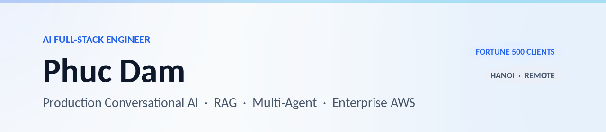

### Hi, I'm Phuc 👋

AI Engineer focused on **shipping production Conversational AI** for enterprise clients — not notebooks, not demos. **3+ years** moving multi-agent systems and RAG pipelines from POC into **AWS-native production** with end-to-end observability, semantic caching, and PII zero-trust.

```text
🛠️   Currently   →  Migrating HR Conversational AI for Covestro AG (Fortune 500)
                    via FPT Software — LangGraph multi-agent, event-driven AWS
🎯   Focus       →  Production-grade RAG · Multi-agent orchestration · LLMOps
🔬   Researching →  Skill-based agent frameworks · LLM-as-judge eval · Semantic caching
📍   Hanoi       →  Open to remote contract work via Upwork
```

---

### 🚀 Featured Work — [Portfolio →](https://maver1ch.github.io)

| Case Study | Client | Stack | Highlight |
|---|---|---|---|
| 🤖 [Enterprise HR Agentic Chatbot](https://maver1ch.github.io/work/hti-agentic-chatbot/) | HTI Group | LangGraph · LlamaIndex · AWS CDK | POC → enterprise AWS production |
| 🏭 [HR Conversational AI Platform](https://maver1ch.github.io/work/fpt-hr-conversational-ai/) | Covestro AG (via FPT Software) | LangGraph · Bedrock · EventBridge · OpenSearch | Fortune 500 zero-downtime migration |
| 📄 [AI Contract Intelligence System](https://maver1ch.github.io/work/fpt-contract-intelligence/) | FPT Software | Qdrant · Bedrock · Skill-based · Prompt Chaining | **+35% extraction accuracy** |

---

### 🛠️ Tech Stack

**LLM Orchestration**


**Cloud & Infra**


**Data & Retrieval**


**LLMOps & Evaluation**


**Languages**


---

### 📊 GitHub Activity

<table>
  <tr>
    <td valign="top">
      
    </td>
    <td valign="top">
      
    </td>
  </tr>
</table>

> Note: stats include private contributions (FPT Software work) — enable via *Settings → Profile → Contributions & Activity → Include private contributions*.

---

### 🔬 Research notes

I write short weekly notes on papers, LLM releases, and AWS AI updates → [maver1ch/research-notes](https://github.com/maver1ch/research-notes).

---

### 📬 Get in touch

- 🌐 Portfolio · [maver1ch.github.io](https://maver1ch.github.io)
- 📧 Email · [damhongphuc.4104@gmail.com](mailto:damhongphuc.4104@gmail.com)
- 💬 WhatsApp · [+84 394 240 555](https://wa.me/84394240555)
- 💼 LinkedIn · [phuc-dam-a74776247](https://www.linkedin.com/in/phuc-dam-a74776247/)
- 🛠️ Upwork · [damhongphuc](https://www.upwork.com/freelancers/~damhongphuc)

<sub>Open to **remote contract work** on production RAG, multi-agent systems, and AWS-native AI infrastructure.</sub>
